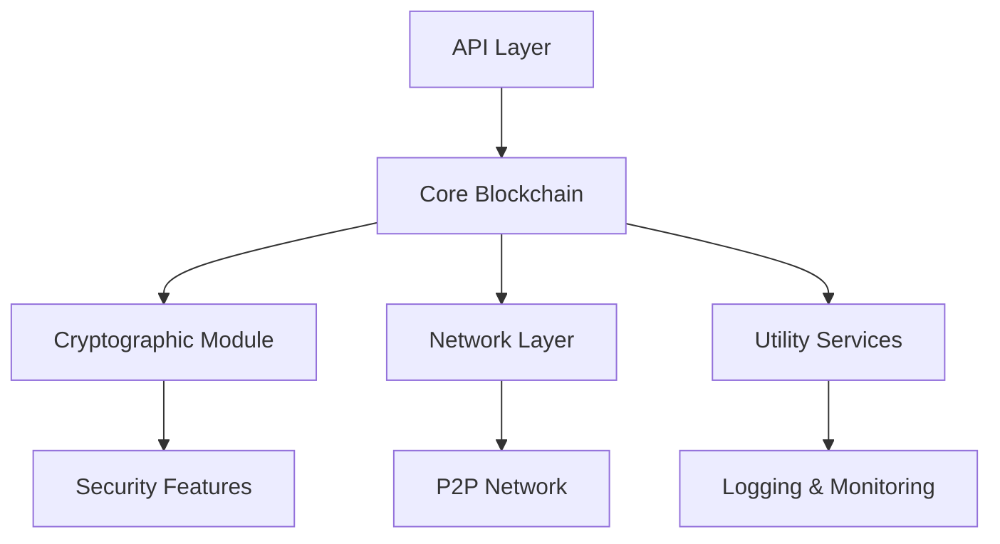
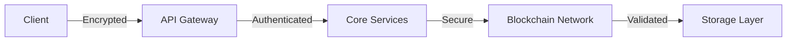
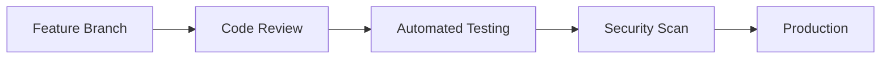

# ShieldCoin
## Secure Blockchain Platform
### Team Backend
**Team Members:**
- [Your Name] - Lead Developer
- [Team Member 2] - Core Developer
- [Team Member 3] - Security Expert

---

## Project Introduction
ShieldCoin is a next-generation blockchain platform focused on:
- Enhanced security through advanced cryptographic techniques
- High-performance transaction processing
- Scalable network architecture
- Developer-friendly API ecosystem

**Project Goals:**
- Create a secure and efficient blockchain platform
- Implement robust consensus mechanisms
- Provide comprehensive developer tools
- Ensure enterprise-grade security

---

## System Architecture Overview


---

## Core Components

### 1. API Layer
**Responsibilities:**
- RESTful API endpoints
- WebSocket support for real-time updates
- Request validation and authentication

**Code Sample:**
```python
from fastapi import FastAPI
from blockchain.api.routes import router

app = FastAPI(title="ShieldCoin API")
app.include_router(router)

@app.get("/health")
async def health_check():
    return {"status": "healthy"}
```

---

### 2. Core Blockchain
**Key Features:**
- Block creation and validation
- Transaction processing
- Chain synchronization
- Smart contract execution

**Code Sample:**
```python
class Block:
    def __init__(self, index, transactions, previous_hash):
        self.index = index
        self.timestamp = time.time()
        self.transactions = transactions
        self.previous_hash = previous_hash
        self.hash = self.calculate_hash()

    def calculate_hash(self):
        block_string = f"{self.index}{self.timestamp}{self.transactions}{self.previous_hash}"
        return hashlib.sha256(block_string.encode()).hexdigest()
```

---

### 3. Cryptographic Module
**Security Features:**
- Digital signatures
- Key management
- Hash functions
- Encryption/Decryption

**Code Sample:**
```python
from cryptography.hazmat.primitives import hashes
from cryptography.hazmat.primitives.asymmetric import padding

def sign_transaction(private_key, transaction):
    signature = private_key.sign(
        transaction.encode(),
        padding.PSS(
            mgf=padding.MGF1(hashes.SHA256()),
            salt_length=padding.PSS.MAX_LENGTH
        ),
        hashes.SHA256()
    )
    return signature
```

---

### 4. Network Layer
**Components:**
- P2P network implementation
- Node discovery
- Message propagation
- Network security

**Code Sample:**
```python
class P2PNetwork:
    def __init__(self):
        self.nodes = set()
        self.message_queue = asyncio.Queue()

    async def broadcast_message(self, message):
        for node in self.nodes:
            await node.send_message(message)
```

---

### 5. Utility Services
**Features:**
- Logging and monitoring
- Configuration management
- Error handling
- Performance metrics

**Code Sample:**
```python
import logging
from blockchain.utils.metrics import MetricsCollector

logger = logging.getLogger('shieldcoin')
metrics = MetricsCollector()

def log_transaction(transaction):
    logger.info(f"Processing transaction: {transaction.id}")
    metrics.increment('transactions_processed')
```

---

## Security Architecture


**Security Measures:**
- End-to-end encryption
- Multi-factor authentication
- Regular security audits
- Automated vulnerability scanning

---

## Performance Optimization
**Key Strategies:**
- Parallel transaction processing
- Caching mechanisms
- Load balancing
- Resource optimization

**Metrics:**
- Transaction throughput: 1000+ TPS
- Block confirmation time: < 2 seconds
- Network latency: < 100ms

---

## Development Workflow


**Tools:**
- Git for version control
- CI/CD pipeline
- Automated testing
- Code quality checks

---

## Future Enhancements
1. **Scalability Improvements**
   - Sharding implementation
   - Layer 2 solutions
   - Cross-chain interoperability

2. **Feature Additions**
   - Advanced smart contracts
   - Privacy features
   - Governance mechanisms

3. **Ecosystem Growth**
   - Developer documentation
   - SDK development
   - Community engagement

---

## Questions & Discussion
Thank you for your attention!

**Contact:**
- GitHub: [Your GitHub]
- Email: [Your Email]
- Documentation: [Your Docs Link] 